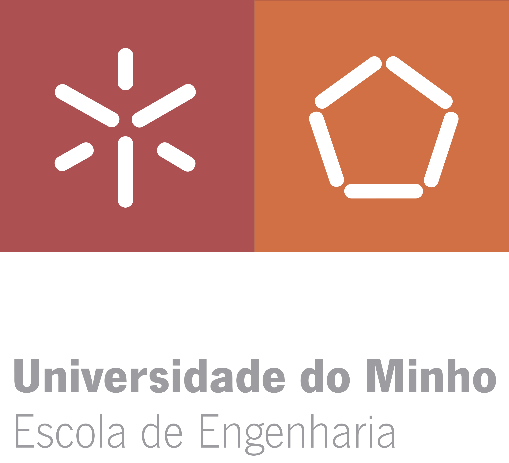

<h3 align="center">Licenciatura em Engenharia Informática   Trabalho prático de Processamento de Linguagens   2022/2023 </h3>

---
<h3 align="center"> Colaboradores &#129309 </h2>

| Nome                             | Número |
|----------------------------------|--------|
| Miguel Silva Pinto               | A96106 |
| Orlando José da Cunha Palmeira   | A97755 |
| Pedro Miguel Castilho Martins    | A97613 |

### Nota: 17 / 20

<h3><i>Keywords</i></h3>
CG, Processamento de Linguagens, processamento de linguagens, uminho, miei, lei, engenharia informatica
